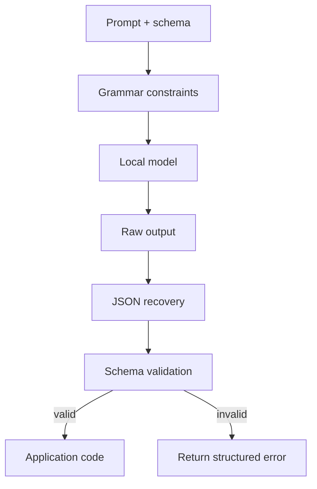

# Structured output

Structured output means that a model response must follow a known shape instead of free-form prose. In Edge Veda, this is useful when an app needs JSON, tool arguments, extracted fields, classifications, or other machine-readable results.

A local model can write useful text, but application code usually needs predictable data. Structured output creates a contract between the model and the app.

## Why structured output matters

Free-form model output is hard to use safely in application logic. It may include extra text, missing fields, wrong types, invalid JSON, or explanations that break parsers.

Structured output is useful for:

- extracting fields from text;
- classifying a user request;
- producing tool arguments;
- generating app state;
- returning search filters;
- validating forms;
- creating summaries with fixed sections;
- producing data for charts or tables.

## Core concepts

| Concept | Meaning |
| --- | --- |
| Grammar-constrained generation | The model is constrained to produce text that matches a grammar. |
| GBNF | A grammar format often used to constrain local model output. |
| JSON schema | A shape describing required fields, types, enums, and nested objects. |
| `sendStructured()` | A high-level API concept for requesting validated structured output. |
| Strict validation | Rejects output that does not match the expected shape. |
| Standard validation | Allows repair or partial recovery where safe. |
| Validation telemetry | Events that explain whether output was valid, repaired, or rejected. |

SDK names should be verified against the current source before publishing code examples.

## Structured output flow



The app should use the validated result, not the raw model text.

## Grammar constraints

Grammar constraints reduce invalid output by limiting what the model can produce. For JSON, the grammar can enforce braces, brackets, strings, numbers, booleans, and allowed structural patterns.

Grammar constraints help with:

- valid JSON;
- fixed object shape;
- enum values;
- nested structures;
- arrays with known item types.

They do not guarantee semantic correctness. A field can be syntactically valid and still be wrong.

## JSON recovery

Local model output may be truncated or malformed. JSON recovery can repair safe issues such as:

- missing closing brackets;
- trailing garbage after JSON;
- unclosed strings;
- minor structural truncation.

Recovery should be conservative. It should not invent required business facts. If the output cannot be safely repaired, return a validation error.

## Strict vs standard modes

Structured output often needs more than one validation mode.

| Mode | Behavior | Use case |
| --- | --- | --- |
| Strict | Reject anything that does not fully match the schema. | Payments, permissions, medical/legal forms, destructive actions. |
| Standard | Try safe repair and return warnings. | Drafting, classification, extraction with human review. |

If output will trigger a side effect, use strict validation.

## Schema design

A good schema is clear and small.

Recommendations:

- keep fields minimal;
- use enums where possible;
- avoid ambiguous field names;
- document required and optional fields;
- include `confidence` only if the app knows how to use it;
- avoid open-ended nested structures;
- prefer arrays of objects over unstructured prose;
- validate field length and allowed values.

The model follows schemas better when the schema matches the task.

## Example use cases

### Intent classification

```json
{
  "intent": "search_documents",
  "confidence": 0.86,
  "query": "battery policy"
}
```

### Field extraction

```json
{
  "document_type": "invoice",
  "invoice_number": "INV-2026-104",
  "total_amount": 1200.50,
  "currency": "USD"
}
```

### Tool arguments

```json
{
  "tool": "create_note",
  "arguments": {
    "title": "Meeting follow-up",
    "tags": ["work", "follow-up"]
  }
}
```

## Validation events

Validation telemetry helps developers understand how reliable structured output is.

Useful events:

- grammar applied;
- output received;
- recovery attempted;
- recovery succeeded or failed;
- schema validation passed;
- missing required field;
- wrong type;
- enum mismatch;
- output rejected;
- repair count.

These events are especially useful in enterprise or long-session debugging.

## Common failure modes

| Symptom | Possible cause | Fix |
| --- | --- | --- |
| Parser fails | Raw output is not valid JSON. | Use grammar constraints and recovery. |
| Required field missing | Schema is too complex or prompt is unclear. | Simplify schema and add examples. |
| Wrong enum value | Enum not clearly constrained. | Add allowed values and strict validation. |
| Output contains prose | Prompt permits explanations. | Instruct model to return only JSON. |
| Valid JSON but wrong facts | Retrieval or prompt context is weak. | Validate against source data. |

## Documentation checklist

When documenting structured output, include:

- expected schema;
- validation mode;
- grammar behavior;
- recovery behavior;
- examples of valid output;
- invalid output examples;
- error handling;
- telemetry events;
- privacy concerns;
- whether output can trigger side effects.

## Summary

Structured output turns model responses into predictable data. Edge Veda should validate and observe structured output before the app uses it, especially when the result controls tools, permissions, workflows, or stored state.
