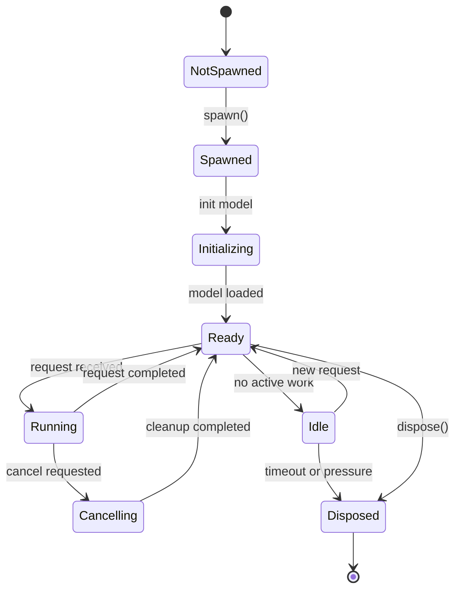

# Workers and isolates

Workers are long-lived execution units that Edge Veda uses to run expensive AI workloads away from the Flutter UI thread. In Dart, this usually means isolates or isolate-like background execution contexts.

The worker model lets a model load once, stay available across requests, stream results back to the app, and be supervised by the runtime.

## Why workers are needed

AI workloads are expensive. Loading a local model, generating tokens, transcribing audio, processing images, or running diffusion can block the UI if done directly in application code.

Workers solve several problems:

- keep inference away from the UI thread;
- keep a model loaded across multiple requests;
- create a lifecycle boundary for native resources;
- allow progress and streaming events;
- give the Scheduler a unit it can supervise;
- make cancellation and disposal explicit.

## What an isolate is

A Dart isolate is an independent execution context with its own memory. It communicates by messages instead of sharing mutable state directly.

This matters because an AI worker may need to:

- receive an initialization message;
- load a model from a local path;
- hold native handles;
- receive generation or transcription requests;
- stream partial results;
- report progress;
- receive cancellation commands;
- release native resources.

A worker is best understood as a background actor with state and lifecycle, not as a normal synchronous object.

## Persistent workers

A persistent worker remains alive after one request completes. This is useful because local model loading is expensive.

Examples:

- a text worker loads a language model once and serves many `generate()` or `generateStream()` calls;
- a vision worker loads a vision-language model once and processes many camera frames;
- a speech worker keeps transcription state across audio chunks;
- an image worker loads a diffusion model and generates several images before idle disposal.

Persistent workers improve repeated request latency, but they also keep memory allocated. Runtime supervision decides when that trade-off is no longer safe.

## Worker lifecycle

Documentation should explain which SDK methods spawn a worker, reuse it, or dispose it.

## Message types

| Message type | Direction | Purpose |
| --- | --- | --- |
| Init | Main → worker | Load a model and configure the native engine. |
| Request | Main → worker | Start generation, embedding, transcription, or vision analysis. |
| Progress | Worker → main | Report tokens, audio chunks, diffusion steps, or other progress. |
| Result | Worker → main | Return final output. |
| Error | Worker → main | Report failure. |
| Cancel | Main → worker | Stop the active request. |
| Dispose | Main → worker | Release model resources and stop the worker. |

Large payloads such as image buffers and audio chunks should be handled carefully because repeated copying can become expensive.

## Worker types

### Text generation worker

A text worker loads a language model and handles blocking or streaming generation.

Responsibilities:

- initialize the model;
- apply prompt or chat templates;
- manage context settings;
- stream tokens;
- report generation metrics;
- clean up native resources.

### Vision worker

A vision worker processes images or camera frames. It may need both a model file and a matching projector file.

### Speech worker

A speech worker handles speech-to-text workloads, accepts audio chunks, processes them, and streams partial transcripts.

### Image generation worker

An image worker handles diffusion-based generation. This workload is memory-heavy and may run for many seconds. It should report progress, support cancellation, and participate in runtime memory policies.

## Cancellation

Cancellation is part of the worker contract. A user may stop a streaming response, leave a screen, cancel image generation, or interrupt transcription.

A safe cancellation flow:

1. the app sends a cancel message;
2. the worker stops accepting more chunks for that request;
3. native inference is interrupted if possible;
4. partial output is returned or discarded according to feature logic;
5. the worker returns to `Ready` or is disposed;
6. the app updates the UI.

## Error boundaries

A worker should convert native or runtime failures into documented errors.

Examples:

- model file missing;
- unsupported model format;
- initialization failed;
- out-of-memory pressure;
- permission denied;
- image buffer has the wrong size;
- generation cancelled;
- native engine returned an error code.

Errors should help developers without logging sensitive prompts, images, audio, or documents.

## Summary

Workers and isolates make Edge Veda practical for real Flutter apps. They keep inference off the UI thread, allow models to stay loaded, support streaming and progress events, and give runtime supervision concrete units to schedule, cancel, evict, and dispose.
