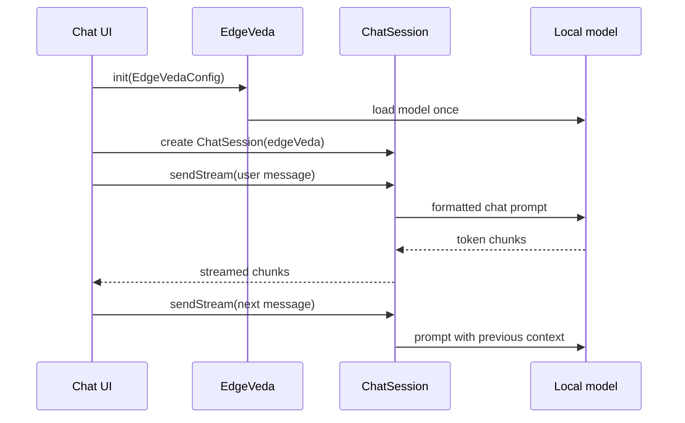

# First streaming chat

This guide shows how to build a minimal multi-turn chat screen with Edge Veda.

Use this page after you have completed:

1. [`overview.md`](./overview.md)
2. [`installation.md`](./installation.md)
3. [`first-text-generation.md`](./first-text-generation.md)

The previous guide uses `EdgeVeda.generateStream()` directly. This guide adds `ChatSession`, which keeps conversation state across turns and formats messages with a chat template.

## What you will build

You will build a Flutter screen that:

- downloads or reuses a local chat model;
- initializes `EdgeVeda`;
- creates a `ChatSession`;
- sends user messages with `sendStream()`;
- streams assistant tokens into the UI;
- keeps the conversation context between messages;
- resets the chat without unloading the model.

## When to use `ChatSession`

Use `ChatSession` when the model should remember previous turns in the same conversation.

Use direct `EdgeVeda.generateStream()` when you need:

- a single prompt;
- a stateless completion;
- a small utility request;
- a lower-level streaming primitive.

Use `ChatSession.sendStream()` when you need:

- multi-turn chat;
- system prompts;
- model-specific chat formatting;
- context usage tracking;
- conversation reset.

## Basic chat flow



## Minimal console example

This example assumes that `edgeVeda` has already been initialized.

```dart
final session = ChatSession(
  edgeVeda: edgeVeda,
  preset: SystemPromptPreset.coder,
);

await for (final chunk in session.sendStream('Write hello world in Python')) {
  stdout.write(chunk.token);
}

await for (final chunk in session.sendStream('Now convert it to Rust')) {
  stdout.write(chunk.token);
}

print('Turns: ${session.turnCount}');
print('Context: ${(session.contextUsage * 100).toInt()}%');
```

The second message can refer to the first answer because the session keeps conversation context.

## Replace `lib/main.dart`

The following example creates a simple chat UI. It intentionally stays small so you can use it as a quickstart sample.

```dart
import 'package:edge_veda/edge_veda.dart';
import 'package:flutter/material.dart';

void main() => runApp(const MyApp());

class ChatMessage {
  const ChatMessage({required this.role, required this.text});

  final String role;
  final String text;
}

class MyApp extends StatelessWidget {
  const MyApp({super.key});

  @override
  Widget build(BuildContext context) {
    return const MaterialApp(
      title: 'Edge Veda Streaming Chat',
      home: StreamingChatScreen(),
    );
  }
}

class StreamingChatScreen extends StatefulWidget {
  const StreamingChatScreen({super.key});

  @override
  State<StreamingChatScreen> createState() => _StreamingChatScreenState();
}

class _StreamingChatScreenState extends State<StreamingChatScreen> {
  final _edgeVeda = EdgeVeda();
  final _modelManager = ModelManager();
  final _controller = TextEditingController();

  ChatSession? _session;
  final List<ChatMessage> _messages = [];

  bool _isReady = false;
  bool _isGenerating = false;
  String _status = 'Initializing...';

  @override
  void initState() {
    super.initState();
    _setup();
  }

  Future<void> _setup() async {
    try {
      setState(() => _status = 'Downloading model...');

      final modelPath = await _modelManager.downloadModel(
        ModelRegistry.llama32_1b,
      );

      final device = DeviceProfile.detect();
      final scored = ModelAdvisor.score(
        model: ModelRegistry.llama32_1b,
        device: device,
        useCase: UseCase.chat,
      );

      setState(() => _status = 'Loading model...');

      await _edgeVeda.init(EdgeVedaConfig(
        modelPath: modelPath,
        contextLength: scored.recommendedConfig.contextLength,
        numThreads: scored.recommendedConfig.numThreads,
        useGpu: true,
      ));

      _session = ChatSession(
        edgeVeda: _edgeVeda,
        preset: SystemPromptPreset.coder,
      );

      if (!mounted) return;
      setState(() {
        _status = 'Ready';
        _isReady = true;
      });
    } catch (error) {
      if (!mounted) return;
      setState(() {
        _status = 'Initialization error: $error';
        _isReady = false;
      });
    }
  }

  Future<void> _send() async {
    final text = _controller.text.trim();
    final session = _session;

    if (text.isEmpty || session == null || _isGenerating) return;

    _controller.clear();

    setState(() {
      _messages.add(ChatMessage(role: 'user', text: text));
      _messages.add(const ChatMessage(role: 'assistant', text: ''));
      _isGenerating = true;
      _status = 'Generating...';
    });

    final assistantIndex = _messages.length - 1;

    try {
      await for (final chunk in session.sendStream(text)) {
        if (!mounted) return;

        if (!chunk.isFinal) {
          setState(() {
            final current = _messages[assistantIndex];
            _messages[assistantIndex] = ChatMessage(
              role: current.role,
              text: current.text + chunk.token,
            );
          });
        }
      }

      if (!mounted) return;
      setState(() {
        _status =
            'Ready · turns: ${session.turnCount} · context: ${(session.contextUsage * 100).toInt()}%';
      });
    } catch (error) {
      if (!mounted) return;
      setState(() {
        _messages[assistantIndex] = ChatMessage(
          role: 'assistant',
          text: 'Generation error: $error',
        );
        _status = 'Generation error';
      });
    } finally {
      if (mounted) {
        setState(() => _isGenerating = false);
      }
    }
  }

  void _resetChat() {
    _session?.reset();

    setState(() {
      _messages.clear();
      _status = 'Ready · chat reset';
    });
  }

  @override
  void dispose() {
    _controller.dispose();
    _edgeVeda.dispose();
    _modelManager.dispose();
    super.dispose();
  }

  @override
  Widget build(BuildContext context) {
    return Scaffold(
      appBar: AppBar(
        title: const Text('Streaming chat'),
        actions: [
          TextButton(
            onPressed: _isReady && !_isGenerating ? _resetChat : null,
            child: const Text('Reset'),
          ),
        ],
      ),
      body: Padding(
        padding: const EdgeInsets.all(16),
        child: Column(
          children: [
            Align(
              alignment: Alignment.centerLeft,
              child: Text(_status),
            ),
            const SizedBox(height: 12),
            Expanded(
              child: ListView.builder(
                itemCount: _messages.length,
                itemBuilder: (context, index) {
                  final message = _messages[index];
                  final isUser = message.role == 'user';

                  return Align(
                    alignment:
                        isUser ? Alignment.centerRight : Alignment.centerLeft,
                    child: Container(
                      margin: const EdgeInsets.symmetric(vertical: 6),
                      padding: const EdgeInsets.all(12),
                      constraints: const BoxConstraints(maxWidth: 320),
                      decoration: BoxDecoration(
                        color: isUser
                            ? Colors.blue.shade100
                            : Colors.grey.shade200,
                        borderRadius: BorderRadius.circular(12),
                      ),
                      child: Text(message.text.isEmpty
                          ? '...'
                          : message.text),
                    ),
                  );
                },
              ),
            ),
            const SizedBox(height: 12),
            Row(
              children: [
                Expanded(
                  child: TextField(
                    controller: _controller,
                    enabled: _isReady && !_isGenerating,
                    decoration: const InputDecoration(
                      border: OutlineInputBorder(),
                      hintText: 'Ask something...',
                    ),
                    onSubmitted: (_) => _send(),
                  ),
                ),
                const SizedBox(width: 8),
                ElevatedButton(
                  onPressed: _isReady && !_isGenerating ? _send : null,
                  child: Text(_isGenerating ? '...' : 'Send'),
                ),
              ],
            ),
          ],
        ),
      ),
    );
  }
}
```

## Run the chat

Run on a physical iPhone in release mode:

```bash
flutter run --release
```

The first launch may spend time on model download and model loading. Later launches should reuse the cached model.

## How streaming updates the UI

The important part is this loop:

```dart
await for (final chunk in session.sendStream(text)) {
  if (!chunk.isFinal) {
    setState(() {
      assistantText += chunk.token;
    });
  }
}
```

Each chunk contains a partial token or token fragment. Append it to the assistant message and update the UI.

## Resetting the conversation

Use `session.reset()` when the user wants to start a new conversation.

```dart
session.reset();
```

Resetting clears the conversation history. It does not unload the model from the runtime, so the next response should not require a full model reload.

## Monitoring context usage

Show `contextUsage` in development builds to understand when a chat is getting long:

```dart
final percent = (session.contextUsage * 100).toInt();
print('Context used: $percent%');
```

If context usage grows too high, either reset the session or rely on the session’s context management behavior if enabled by the SDK version you are using.

## Common mistakes

| Mistake | Why it is a problem | Fix |
| --- | --- | --- |
| Creating a new `ChatSession` for every message | The model cannot preserve conversation context. | Create one session per conversation. |
| Calling `sendStream()` twice at the same time | Concurrent writes can corrupt UI state or produce confusing output. | Disable the send button while generation is running. |
| Updating UI after the widget is disposed | Flutter throws lifecycle errors. | Check `mounted` in async code. |
| Using the wrong chat template for the model | Output can become repeated or malformed. | Match the model family to the template format. |
| Testing speed in debug mode | Debug mode is not representative of real inference speed. | Use `flutter run --release` or `flutter run --profile`. |

## Next step

Continue with [`model-setup.md`](./model-setup.md) to choose, download, import, and validate local models.
