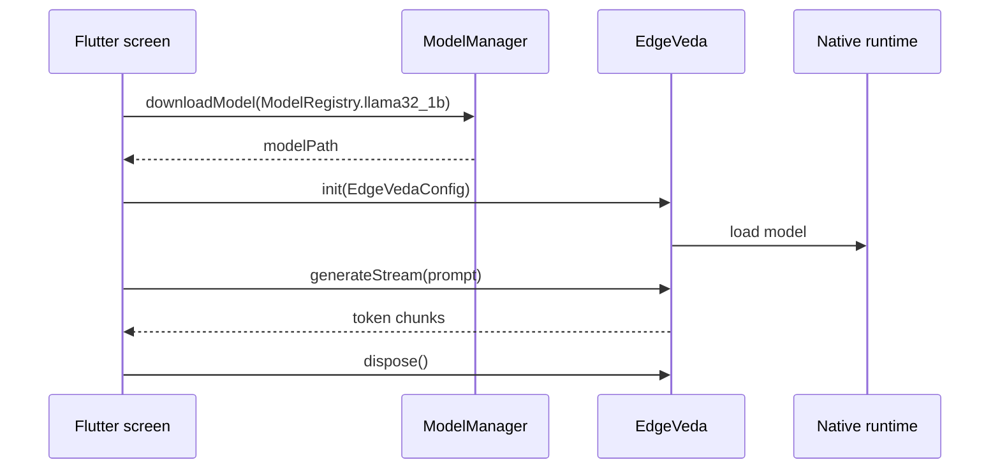

# First text generation

This guide creates a minimal Flutter screen that downloads a starter model, initializes Edge Veda, and streams generated text into the UI.

By the end, you will have a local text generation flow that runs on the device without a cloud inference API.

## Before you start

Complete [`installation.md`](./installation.md) first.

You should have:

- a Flutter project with `edge_veda` installed;
- an iOS target with `platform :ios, '13.0'` in `ios/Podfile`;
- CocoaPods installed and pods resolved;
- a physical iPhone connected for realistic performance testing.

## How the example works

The example uses this sequence:

1. Create `EdgeVeda` and `ModelManager` instances.
2. Download or reuse the starter model from `ModelRegistry`.
3. Detect the device profile.
4. Ask `ModelAdvisor` for a recommended configuration.
5. Initialize the runtime with `EdgeVedaConfig`.
6. Stream generated tokens with `generateStream()`.
7. Dispose runtime resources when the screen is closed.



## Replace `lib/main.dart`

Replace the contents of `lib/main.dart` with this example:

```dart
import 'package:edge_veda/edge_veda.dart';
import 'package:flutter/material.dart';

void main() => runApp(const MyApp());

class MyApp extends StatelessWidget {
  const MyApp({super.key});

  @override
  Widget build(BuildContext context) {
    return const MaterialApp(
      title: 'Edge Veda Quickstart',
      home: TextGenerationScreen(),
    );
  }
}

class TextGenerationScreen extends StatefulWidget {
  const TextGenerationScreen({super.key});

  @override
  State<TextGenerationScreen> createState() => _TextGenerationScreenState();
}

class _TextGenerationScreenState extends State<TextGenerationScreen> {
  final _edgeVeda = EdgeVeda();
  final _modelManager = ModelManager();

  String _output = 'Initializing...';
  bool _isLoading = true;

  @override
  void initState() {
    super.initState();
    _setup();
  }

  Future<void> _setup() async {
    try {
      setState(() {
        _output = 'Downloading model...';
        _isLoading = true;
      });

      final modelPath = await _modelManager.downloadModel(
        ModelRegistry.llama32_1b,
      );

      final device = DeviceProfile.detect();
      final scored = ModelAdvisor.score(
        model: ModelRegistry.llama32_1b,
        device: device,
        useCase: UseCase.chat,
      );

      final config = EdgeVedaConfig(
        modelPath: modelPath,
        contextLength: scored.recommendedConfig.contextLength,
        numThreads: scored.recommendedConfig.numThreads,
        useGpu: true,
      );

      setState(() {
        _output = 'Loading model...';
      });

      await _edgeVeda.init(config);

      if (!mounted) return;
      setState(() {
        _output = 'Ready. Tap Generate.';
        _isLoading = false;
      });
    } catch (error) {
      if (!mounted) return;
      setState(() {
        _output = 'Initialization error: $error';
        _isLoading = false;
      });
    }
  }

  Future<void> _generate() async {
    setState(() {
      _output = '';
      _isLoading = true;
    });

    try {
      await for (final chunk in _edgeVeda.generateStream(
        'Explain what on-device AI means in two short sentences.',
      )) {
        if (!mounted) return;

        if (!chunk.isFinal) {
          setState(() {
            _output += chunk.token;
          });
        }
      }
    } catch (error) {
      if (!mounted) return;
      setState(() {
        _output = 'Generation error: $error';
      });
    } finally {
      if (mounted) {
        setState(() {
          _isLoading = false;
        });
      }
    }
  }

  @override
  void dispose() {
    _edgeVeda.dispose();
    _modelManager.dispose();
    super.dispose();
  }

  @override
  Widget build(BuildContext context) {
    return Scaffold(
      appBar: AppBar(title: const Text('Edge Veda Quickstart')),
      body: Padding(
        padding: const EdgeInsets.all(16),
        child: Column(
          crossAxisAlignment: CrossAxisAlignment.stretch,
          children: [
            Expanded(
              child: SingleChildScrollView(
                child: Text(
                  _output,
                  style: const TextStyle(fontSize: 16),
                ),
              ),
            ),
            const SizedBox(height: 16),
            ElevatedButton(
              onPressed: _isLoading ? null : _generate,
              child: Text(_isLoading ? 'Working...' : 'Generate'),
            ),
          ],
        ),
      ),
    );
  }
}
```

## Run the app

Run on a physical iPhone in release mode:

```bash
flutter run --release
```

The first run can take longer because the model must be downloaded and loaded. Later runs should reuse the cached model.

## Blocking generation alternative

Use `generate()` when you want the full response only after generation completes:

```dart
final response = await _edgeVeda.generate(
  'Give me one practical use case for on-device AI.',
);

print(response.text);
```

Use `generateStream()` when the UI should show tokens as they arrive.

## What to expect

When the app is working:

1. The screen shows `Downloading model...` on the first launch.
2. The screen changes to `Loading model...` while the inference engine initializes.
3. The screen shows `Ready. Tap Generate.`.
4. After tapping **Generate**, text appears progressively.

## Troubleshooting

| Symptom | Possible cause | Fix |
| --- | --- | --- |
| The first launch takes a long time | The model is downloading or loading for the first time. | Keep the app open and use Wi-Fi. |
| Output appears very slowly | The app is running in debug mode or on Simulator. | Use `flutter run --release` on a physical iPhone. |
| `Initialization error` appears | Model download, storage, or runtime initialization failed. | Check device storage, network, and Xcode logs. |
| `Generation error` appears | Runtime failed during generation. | Retry with a shorter prompt and inspect logs. |
| Button stays disabled | `_isLoading` was not reset after an exception. | Confirm the `finally` block updates state when mounted. |
| App crashes after leaving the screen | Runtime resources were not released. | Keep `dispose()` and release `EdgeVeda` and `ModelManager`. |

## Next steps

After the first generation works, continue with:

- multi-turn chat documentation;
- model compatibility notes;
- performance tuning;
- runtime supervision;
- troubleshooting and platform notes.
