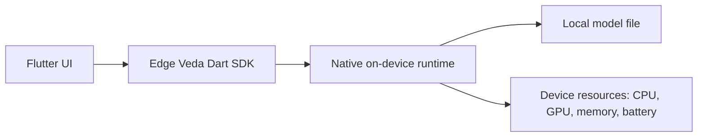

# Edge Veda overview

Edge Veda is a managed on-device AI runtime for Flutter applications. It is designed to run AI workloads on the user’s device instead of sending inference requests to a cloud API.

Use this page as the starting point before installing the SDK or running your first text generation example.

## What Edge Veda does

Edge Veda provides a supervised runtime for local AI features in Flutter apps. It focuses on long-running, observable, device-aware inference rather than short demo-only model calls.

At a high level, Edge Veda can be used for:

- text generation and streaming token output;
- multi-turn chat sessions;
- vision and image understanding workflows;
- speech-to-text and text-to-speech workflows;
- embeddings and on-device retrieval-augmented generation;
- structured output and function calling;
- runtime supervision for memory, battery, thermal, and latency constraints.

## Why use an on-device runtime

On-device AI is useful when an app needs to keep data local, reduce dependency on network connectivity, or provide AI features without a cloud inference service.

Edge Veda is especially relevant when you need to:

- process sensitive user input locally;
- avoid API keys in the app runtime;
- keep inference available when the network is slow or unavailable;
- monitor runtime behavior under real device constraints;
- reuse the same loaded model across multiple generation calls.

## How Edge Veda fits into a Flutter app

A typical Edge Veda integration has four parts:

1. **Flutter app UI** — collects the prompt, displays output, and handles user actions.
2. **Edge Veda Dart SDK** — exposes the public Flutter/Dart APIs such as `EdgeVeda`, `EdgeVedaConfig`, `ModelManager`, and generation methods.
3. **Native runtime** — runs the underlying local inference engine through native bindings.
4. **Model files** — local model assets downloaded, imported, or bundled with the application.



## Current getting-started path

The recommended first path is:

1. Read this overview.
2. Install the SDK and configure the iOS project in [`installation.md`](./installation.md).
3. Run your first local text generation example in [`first-text-generation.md`](./first-text-generation.md).

This Getting Started section focuses on the iOS path because it is the most clearly documented quickstart path in the project. Treat other platforms as requiring verification before publishing production documentation.

## What you will build first

The first example initializes Edge Veda, loads a local model, and streams generated text into a Flutter screen.

The minimal flow is:

```dart
final edgeVeda = EdgeVeda();

await edgeVeda.init(EdgeVedaConfig(
  modelPath: modelPath,
  contextLength: 2048,
  useGpu: true,
));

await for (final chunk in edgeVeda.generateStream('Explain on-device AI briefly.')) {
  if (!chunk.isFinal) {
    stdout.write(chunk.token);
  }
}
```

## Main concepts

| Concept | Meaning |
| --- | --- |
| `EdgeVeda` | Main SDK entry point for text inference and runtime lifecycle. |
| `EdgeVedaConfig` | Runtime configuration used when initializing the model. |
| `ModelManager` | Downloads or imports supported model files. |
| `ModelRegistry` | Provides known model definitions, such as `ModelRegistry.llama32_1b`. |
| `ModelAdvisor` | Scores and recommends model configuration for the current device. |
| `generate()` | Runs a blocking text generation request and returns the full response. |
| `generateStream()` | Streams generated chunks as they become available. |
| `dispose()` | Releases runtime resources when the feature or screen is no longer needed. |

## Recommended first model

For a first text generation test, start with `ModelRegistry.llama32_1b` unless the project documentation or maintainers recommend a newer default model. It is used in the official quickstart path and is suitable for validating the basic setup.

## What Edge Veda is not

Edge Veda is not a hosted model API and does not replace a cloud AI platform. It is a local runtime for apps that need on-device AI behavior.

Do not treat it as:

- a general-purpose backend service;
- a replacement for server-side model orchestration;
- a zero-cost way to run any model on any phone;
- a guarantee that all models will fit on all devices.

Model size, quantization, memory, device generation, and release/debug mode all affect the user experience.

## Next step

Continue with [`installation.md`](./installation.md) to add Edge Veda to a Flutter project and prepare the iOS runtime.
