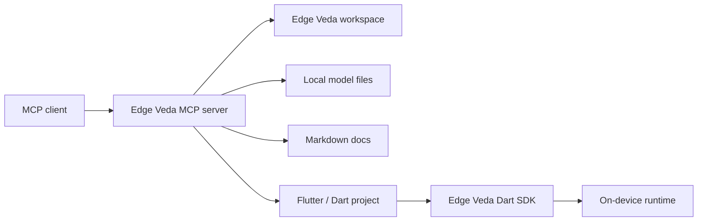

# MCP overview

The Edge Veda MCP integration lets an AI client interact with an Edge Veda workspace through a controlled local tool layer.

MCP stands for **Model Context Protocol**. In this documentation set, MCP is used to expose project, model, diagnostics, and documentation helpers to compatible AI clients without giving the model unrestricted access to the file system.

Use this section when you want to:

- connect an MCP-compatible client to an Edge Veda project;
- inspect local project state through tools;
- create a starter Edge Veda project from a template;
- validate model paths, platform settings, and project structure;
- collect troubleshooting data without manually searching through the repository.

## Where MCP fits in Edge Veda

Edge Veda is designed for on-device AI workflows: text generation, streaming, embeddings, RAG, vision, speech, image generation, runtime policy, scheduler behavior, and offline privacy. The MCP layer does not replace the Dart SDK. It gives external AI clients a safe way to call helper tools around the SDK and the project workspace.



## Main components

| Component | Responsibility |
| --- | --- |
| MCP client | Sends tool calls and displays the result to the user. |
| Edge Veda MCP server | Exposes project-specific tools, validates inputs, and returns structured responses. |
| Edge Veda workspace | Contains app code, model configuration, examples, docs, and generated artifacts. |
| Local model store | Stores GGUF, Whisper, VLM, image generation, or embedding models used by the app. |
| Dart SDK | Runs Edge Veda capabilities inside the Flutter or Dart application. |

## Request flow

A typical MCP request follows this path:

1. The user asks the AI client to inspect, create, or troubleshoot something in an Edge Veda project.
2. The AI client chooses an Edge Veda MCP tool.
3. The MCP server validates the requested `workspaceRoot`, `projectName`, `modelPath`, and other inputs.
4. The MCP server reads or writes only the allowed files.
5. The MCP server returns a structured result with a summary, changed files, warnings, and next actions.
6. The user reviews the result before running, committing, or publishing anything.

## What the MCP server can help with

The MCP server is intended to support tasks such as:

- creating a starter project;
- validating project structure;
- listing available tools and required arguments;
- checking whether model files exist;
- detecting common installation issues;
- generating starter configuration files;
- creating basic documentation stubs;
- checking docs links and file naming;
- collecting environment diagnostics for troubleshooting.

## What the MCP server should not do

Do not use MCP tools as a replacement for direct source review or production release validation.

The MCP server should not:

- publish packages automatically;
- upload models to external services;
- send user prompts, documents, audio, or images to a remote service without explicit configuration;
- modify production secrets;
- commit or push code without user approval;
- claim that generated code is production-ready without manual review.

## Example MCP client configuration

The exact file location depends on the MCP client. Use this example as a starting point and adapt the command to your installation method.

```json
{
  "mcpServers": {
    "edge-veda": {
      "command": "edge-veda-mcp",
      "args": [
        "--workspace-root",
        "/absolute/path/to/edge-veda-app",
        "--config",
        "/absolute/path/to/edge-veda.mcp.json"
      ],
      "env": {
        "EDGE_VEDA_MCP_LOG_LEVEL": "info"
      }
    }
  }
}
```

## Example workspace configuration

Create `edge-veda.mcp.json` in the project root when the MCP server needs project-specific defaults.

```json
{
  "workspaceRoot": ".",
  "projectType": "flutter",
  "docsRoot": "docs",
  "modelsRoot": "models",
  "defaultPlatforms": ["ios", "macos"],
  "allowWrites": true,
  "allowedWritePaths": [
    "lib",
    "test",
    "docs",
    "examples",
    "edge_veda.config.json"
  ]
}
```

## Security model

Treat the MCP server as a local automation layer with explicit boundaries.

Recommended defaults:

- allow reads only inside `workspaceRoot`;
- allow writes only to known project paths;
- keep `allowWrites` disabled for audit-only sessions;
- never expose private keys, Apple signing certificates, or production credentials through MCP results;
- review all generated files before running them;
- commit MCP-generated changes through a normal pull request.

## Privacy model

Edge Veda is focused on local and offline AI workflows. MCP should preserve that expectation.

The MCP server should:

- process local project files locally;
- avoid uploading model files or user content;
- redact secrets from diagnostics;
- return file paths and summaries instead of full sensitive documents when possible;
- make any remote dependency explicit in the tool response.

## Common quick checks

| Symptom | Check |
| --- | --- |
| MCP client does not show Edge Veda tools | Confirm that the MCP server command exists in `PATH` and the client configuration points to the correct executable. |
| Tool call fails with `workspace_not_found` | Use an absolute `workspaceRoot` path and confirm the directory contains `pubspec.yaml`. |
| Project creation fails | Check write permissions and verify that the target folder does not already contain conflicting files. |
| Model validation fails | Confirm `modelsRoot`, `modelPath`, file extension, and platform support. |
| Generated docs look incomplete | Run the tool again with a more specific `projectName`, `capabilities`, and `targetPlatforms`. |

## Related documents

- [Installation](./installation.md)
- [Available tools](./available-tools.md)
- [Create project](./create-project.md)
