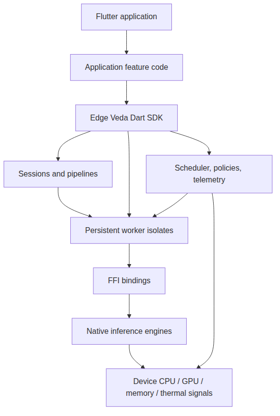
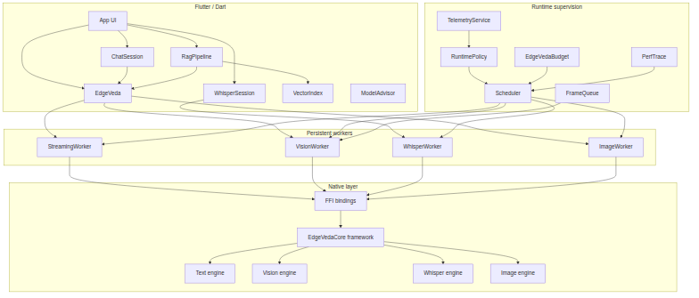
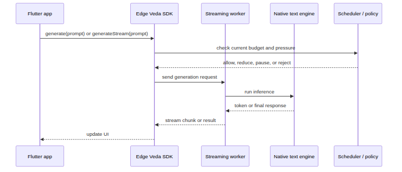
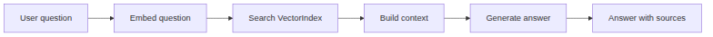
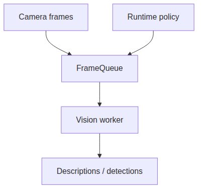
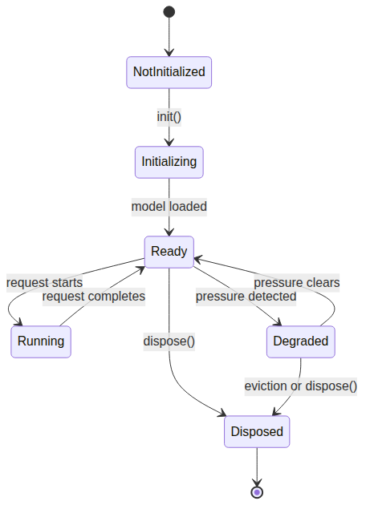

# Архітектура

Edge Veda організований як layered on-device AI runtime. Flutter-застосунок викликає high-level Dart APIs. Ці APIs координують sessions, pipelines, persistent workers, runtime policies, telemetry і native inference engines.

Архітектура спроєктована для long-running local AI workloads. Замість того щоб завантажувати модель для кожного запиту, Edge Veda може тримати workers активними, reuse model state, monitor device pressure і degrade behavior, коли пристрій під навантаженням.

## High-level view

Така структура відділяє product code від low-level runtime concerns. Застосунок відповідає за user experience. Edge Veda відповідає за local AI execution layer.

## Основні шари

### Flutter application layer

Flutter app містить screens, state management, permissions, user flows і application-specific feature logic.

Приклади:

- chat screen;
- document picker;
- voice journal screen;
- camera screen;
- settings screen для model selection;
- local knowledge-base feature.

Застосунок не має знати, як native inference libraries виділяють пам’ять або як реалізовані model workers. Він має викликати SDK і обробляти results, progress, errors і lifecycle events.

### Dart SDK layer

Dart SDK надає public API surface для Flutter developers.

Цей шар включає concepts на кшталт:

- `EdgeVeda` як main entry point;
- configuration objects, наприклад `EdgeVedaConfig`;
- generation methods;
- streaming generation methods;
- embedding methods;
- image description methods;
- image generation methods;
- memory і scheduler-related APIs;
- higher-level sessions і pipelines.

SDK layer потребує стабільної human-readable документації, бо саме з ним інтегрується розробник.

### Sessions and pipelines

Sessions і pipelines збирають lower-level methods у application-ready workflows.

Приклади:

- chat session, яка керує history і templates;
- speech session, яка stream-ить transcription segments;
- RAG pipeline, яка embed, search, inject і generate;
- tool-calling flow, який validation-ить model output проти tool schemas;
- model management flow, який обирає compatible model для current device.

Sessions і pipelines корисні, бо production features рідко викликають лише один primitive method. Їм потрібні state, validation, cancellation і lifecycle behavior.

### Worker layer

Workers — це довгоживучі execution units, зазвичай реалізовані як isolates або background execution contexts. Worker може тримати модель завантаженою між запитами, щоб повторні calls не платили повну loading cost.

Типові worker responsibilities:

- initialize a model;
- keep native handles alive;
- process requests away from the UI thread;
- stream partial results;
- dispose resources when idle or under pressure;
- report progress and errors;
- participate in runtime scheduling.

Приклади workers: text streaming workers, vision workers, speech workers і image generation workers.

### Runtime supervision layer

Runtime supervision відповідає за те, щоб local AI workloads були sustainable на реальних devices.

Цей шар може включати:

- central scheduling;
- budget profiles;
- quality-of-service levels;
- memory pressure handling;
- thermal-state handling;
- battery-aware policies;
- cross-worker eviction;
- frame backpressure;
- structured performance tracing.

Runtime supervision важливий, бо кілька AI workloads можуть конкурувати за ті самі device resources. Наприклад, voice journal може використовувати speech recognition, summarization і embeddings. Document Q&A app може використовувати embeddings і text generation. Camera assistant може комбінувати vision і text generation.

### FFI binding layer

Dart SDK використовує FFI для виклику native libraries. FFI — це міст між Dart code і native C/C++ functions, запакованими для target platform.

Цей шар відповідає за:

- loading native dynamic library або framework;
- mapping Dart types to native types;
- passing model paths, buffers і configuration;
- receiving generated text, embeddings або status codes;
- converting native errors into Dart-level failure states.

Документація FFI internals зазвичай не потрібна кожному app developer, але важлива для contributors, maintainers і advanced troubleshooting.

### Native inference layer

Native layer виконує actual model inference. Він може wrap-ити lower-level engines для text, vision, speech і image generation.

Типові native responsibilities:

- load model files;
- initialize GPU acceleration where available;
- allocate inference buffers;
- run token generation;
- compute embeddings;
- process audio або image inputs;
- return native status information;
- clean up native resources.

Оскільки цей шар працює з memory-intensive workloads, lifecycle і error handling критично важливі.

## Core architecture diagram

## Request lifecycle: text generation

Типовий text generation request проходить через runtime так:

Для streaming застосунок має render chunks as they arrive і дозволяти cancellation.

## Request lifecycle: RAG

RAG flow поєднує retrieval і generation.

Важлива архітектурна ідея: RAG — це не лише text generation. Він залежить від embedding quality, chunking strategy, vector search, prompt construction і answer validation.

## Request lifecycle: continuous vision

Continuous vision відрізняється від one-time generation, бо може створювати необмежений обсяг роботи. Camera може надсилати frames швидше, ніж model їх обробляє.

Безпечна vision architecture потребує backpressure:

Queue не має рости нескінченно. Under pressure runtime може drop frames, reduce resolution, lower frequency або pause processing.

## Resource lifecycle

Model lifecycle — одна з найважливіших частин архітектури Edge Veda.

Розробники мають розуміти, чи конкретний method:

- loads a model;
- reuses an existing worker;
- keeps memory allocated after the call;
- auto-disposes after inactivity;
- can be evicted under pressure;
- requires explicit cleanup.

## Concurrency model

On-device AI workloads дорогі. Кілька одночасних workload-ів можуть створити memory pressure, thermal throttling і unpredictable latency.

Архітектуру Edge Veda варто документувати через такі принципи:

- не блокувати UI thread;
- використовувати workers для long-running inference;
- уникати unlimited queues;
- schedule competing workloads;
- degrade non-critical work first;
- expose backpressure instead of hiding it;
- тримати cancellation і disposal predictable.

## Observability model

On-device AI потребує local observability, бо багато failures не відбуваються на server.

Корисна telemetry включає:

- model load time;
- first-token latency;
- tokens per second;
- memory state;
- thermal state;
- battery level;
- worker lifecycle events;
- dropped frame counts;
- scheduler decisions;
- validation events для structured output.

Документація має допомагати розробникам зрозуміти, які signals доступні та як їх використовувати для debugging.

## Privacy boundary

Privacy boundary — це device. У default architecture prompts, documents, images, audio, embeddings і generated output обробляються локально.

Але розробники все одно мають review:

- app logging;
- crash reporting;
- analytics;
- optional cloud handoff;
- persistent vector indexes;
- local document cache;
- exported performance traces.

Local inference — це не автоматична privacy compliance. Це сильна privacy foundation, яка все одно потребує правильних product decisions.

## Documentation implications

Оскільки Edge Veda — це runtime, документація не має описувати лише method signatures. Вона має пояснювати behavior over time.

Для кожної capability документуйте:

- initialization requirements;
- model compatibility;
- worker lifecycle;
- memory behavior;
- streaming behavior;
- cancellation behavior;
- error states;
- platform support;
- privacy behavior;
- performance notes;
- troubleshooting.

## Підсумок

Архітектура Edge Veda поєднує Flutter-facing SDK, higher-level sessions and pipelines, persistent worker isolates, runtime supervision, FFI bindings і native inference engines.

Ця архітектура створена для real on-device AI: local inference, long sessions, multiple modalities, privacy-first behavior і sustained operation under device constraints.
