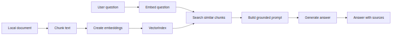

# Embeddings and RAG

`Embeddings` і `RAG` дають Edge Veda-застосунку можливість відповідати на питання за локальними документами, а не лише за знаннями, які вже є в моделі.

`Embedding` перетворює текст на вектор. Схожі за змістом фрагменти мають близькі вектори. `RAG`, або `retrieval-augmented generation`, спочатку знаходить релевантний контент, а потім додає його в `prompt` перед генерацією відповіді.

В Edge Veda цей підхід орієнтований на приватний `on-device document Q&A`. Документи, `embeddings`, `VectorIndex`, знайдений контекст і відповідь можуть залишатися на пристрої користувача.

## Навіщо потрібні embeddings

Локальна мовна модель має обмежений `context`. Вона не знає автоматично всі документи користувача. Вона також не може надійно відповідати за приватними файлами, якщо релевантний контент не передано в `prompt`.

`Embeddings` вирішують частину задачі, пов’язану з пошуком:

1. розбити документи на `chunks`;
2. створити `embedding` для кожного `chunk`;
3. зберегти `embeddings` у локальному `index`;
4. створити `embedding` для питання користувача;
5. знайти схожі `chunks`;
6. передати знайдені `chunks` у `generator`.

Так відповіді стають більш прив’язаними до джерел, а застосунку не потрібно щоразу вставляти в `prompt` великі документи.

## RAG flow



Головна ідея: `generation` не є першим кроком. Перед нею має відбутися `retrieval`.

## Основні building blocks Edge Veda

| Концепція | Роль |
| --- | --- |
| `embed()` | Створює `embedding` для одного текстового input. |
| `embedBatch()` | Створює `embeddings` для кількох input. |
| `VectorIndex` | Зберігає vectors і шукає за `cosine similarity`. |
| `RagPipeline` | Виконує повний flow: `embed`, `search`, `inject`, `generate`. |
| `confidence scoring` | Допомагає визначити слабку впевненість моделі. |
| `cloud handoff signal` | Показує, коли локальна відповідь може потребувати зовнішнього `fallback`, якщо застосунок це підтримує. |

Перед публікацією прикладів коду потрібно звірити назви API з поточним SDK.

## Chunking strategy

`Chunking` визначає, як документ розбивається перед створенням `embedding`. Поганий `chunking` дає слабкий `retrieval`.

Хороший `chunk` має бути:

- достатньо малим, щоб поміститися в `context` разом з іншими `chunks`;
- достатньо великим, щоб не втратити зміст;
- прив’язаним до `metadata`: назви файла, заголовка, сторінки або абзацу;
- стабільним після оновлень застосунку;
- зручним для посилання на джерело у відповіді.

Поширені підходи:

| Підхід | Коли використовувати |
| --- | --- |
| `paragraph chunks` | Для текстових документів і нотаток. |
| `heading-based chunks` | Для Markdown, інструкцій і специфікацій. |
| `sliding window chunks` | Коли зміст переходить між абзацами. |
| `semantic chunks` | Коли застосунок може визначити зміну теми. |

Не варто робити занадто великі `chunks`. Вони витрачають `context` і роблять посилання на джерело нечітким.

## Metadata

Самого vector недостатньо. Кожен embedded `chunk` має зберігати `metadata`.

Корисні `metadata`:

- `document ID`;
- `source path`;
- назва документа;
- заголовок;
- номер сторінки;
- номер абзацу;
- час створення або оновлення;
- текст `chunk`;
- версія `embedding model`.

`Metadata` допомагає показати джерело відповіді та визначити, коли треба перебудувати `index`.

## VectorIndex

`VectorIndex` — це локальний search layer. Він зберігає vectors і повертає найближчі `chunks` для `query vector`.

Корисний `index` має підтримувати:

- пошук за `cosine similarity`;
- локальне збереження;
- пошук за `metadata`;
- delete або update operations;
- `index versioning`;
- rebuild після зміни `embedding model`.

Оскільки Edge Veda орієнтований на `local inference`, `index` треба вважати чутливими локальними даними. Він може містити представлення приватних документів.

## RagPipeline

`RagPipeline` описує end-to-end workflow.

Типовий pipeline:

1. отримує питання користувача;
2. створює `embedding` питання;
3. шукає у `VectorIndex`;
4. вибирає top chunks;
5. будує `grounded prompt`;
6. викликає `local generation`;
7. повертає відповідь і source references.

Pipeline не має вставляти в `prompt` усі знайдені `chunks` без контролю. Він має керувати `token budget` і відхиляти слабкий `retrieval`, якщо результати недостатньо релевантні.

## Prompt construction

`RAG prompt` має чітко розділяти:

- питання користувача;
- `retrieved context`;
- інструкції для відповіді;
- правила для sources або citations;
- поведінку, коли context недостатній.

Рекомендована інструкція:

```text
Answer using only the provided context.
If the context is not enough, say that the answer is not available in the local documents.
Do not invent missing facts.
```

Це зменшує `hallucinations`, але не замінює validation.

## Confidence і fallback

Edge Veda має concepts, пов’язані з `confidence`. Низький `confidence signal` можна використати, щоб показати uncertainty, попросити користувача уточнити питання, знайти більше документів або запропонувати explicit `cloud handoff`, якщо застосунок має hybrid behavior.

Privacy-first застосунок не має непомітно відправляти локальні документи в cloud service. Якщо `cloud fallback` існує, він має бути opt-in і видимим для користувача.

## Типові failure modes

| Симптом | Можлива причина | Виправлення |
| --- | --- | --- |
| Релевантний документ не знайдено | Поганий `chunking`, слабка `embedding model`, відсутній запис в `index`. | Перебудувати `chunks` і `index`; протестувати retrieval queries. |
| Відповідь цитує неправильне джерело | `metadata mismatch`. | Зберігати stable source IDs і перевіряти chunk references. |
| Відповідь вигадує факти | `prompt` не обмежує модель або `retrieval` слабкий. | Додати stricter prompt rules і confidence checks. |
| `index` ламається після оновлення | Змінилася `embedding model`. | Rebuild vectors і оновити `index version`. |
| Search повільний | `index` занадто великий або не оптимізований. | Обмежити corpus size, зберігати `index`, налаштувати nearest-neighbor search. |

## Checklist документації

Коли документуєте embeddings або RAG feature, вкажіть:

- `embedding model` і vector dimension;
- `chunking strategy`;
- `metadata fields`;
- формат збереження `index`;
- update і delete behavior;
- retrieval thresholds;
- prompt construction rules;
- privacy behavior;
- confidence і fallback behavior;
- troubleshooting для weak retrieval.

## Підсумок

`Embeddings` і `RAG` перетворюють локальні документи на retrievable context для local generation. В Edge Veda це дає private document Q&A, semantic search і grounded responses без перенесення даних користувача за межі пристрою.
