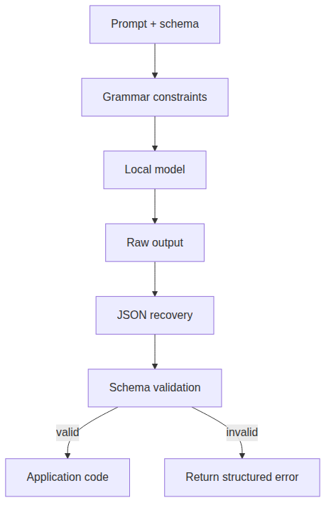

# Structured output

`Structured output` означає, що model response має відповідати відомій shape, а не бути free-form prose. В Edge Veda це корисно, коли застосунку потрібні JSON, tool arguments, extracted fields, classifications або інші machine-readable results.

Local model може писати корисний текст, але application code зазвичай потребує predictable data. `Structured output` створює контракт між model і app.

## Навіщо потрібен structured output

Free-form model output складно безпечно використовувати в application logic. Він може містити зайвий текст, missing fields, wrong types, invalid JSON або explanations, які ламають parser.

`Structured output` корисний для:

- extracting fields from text;
- classifying user request;
- producing tool arguments;
- generating app state;
- returning search filters;
- validating forms;
- creating summaries with fixed sections;
- producing data for charts або tables.

## Core concepts

| Concept | Значення |
| --- | --- |
| Grammar-constrained generation | Model обмежена output, який відповідає grammar. |
| GBNF | Grammar format, який часто використовується для local model output. |
| JSON schema | Shape з required fields, types, enums і nested objects. |
| `sendStructured()` | High-level API concept для validated structured output. |
| Strict validation | Reject output, якщо він не відповідає expected shape. |
| Standard validation | Дозволяє safe repair або partial recovery. |
| Validation telemetry | Events, які пояснюють, чи output valid, repaired або rejected. |

SDK names треба звірити з current source перед code examples.

## Structured output flow



App має використовувати validated result, а не raw model text.

## Grammar constraints

`Grammar constraints` зменшують invalid output, обмежуючи те, що model може згенерувати. Для JSON grammar може enforce-ити braces, brackets, strings, numbers, booleans і allowed structural patterns.

Grammar constraints допомагають з:

- valid JSON;
- fixed object shape;
- enum values;
- nested structures;
- arrays with known item types.

Вони не гарантують semantic correctness. Field може бути syntactically valid, але все одно wrong.

## JSON recovery

Local model output може бути truncated або malformed. `JSON recovery` може repair-ити safe issues:

- missing closing brackets;
- trailing garbage after JSON;
- unclosed strings;
- minor structural truncation.

Recovery має бути conservative. Воно не повинно invent required business facts. Якщо output не можна safe repair, треба повернути validation error.

## Strict vs standard modes

`Structured output` часто потребує більше ніж одного validation mode.

| Mode | Behavior | Use case |
| --- | --- | --- |
| Strict | Reject усе, що не відповідає schema повністю. | Payments, permissions, medical/legal forms, destructive actions. |
| Standard | Спробувати safe repair і повернути warnings. | Drafting, classification, extraction with human review. |

Якщо output запускає side effect, використовуйте strict validation.

## Schema design

Хороша schema має бути clear і small.

Рекомендації:

- мінімізуйте fields;
- використовуйте enums, де можливо;
- уникайте ambiguous field names;
- документуйте required і optional fields;
- додавайте `confidence` лише якщо app знає, як його використовувати;
- уникайте open-ended nested structures;
- використовуйте arrays of objects замість unstructured prose;
- перевіряйте field length і allowed values.

Model краще follows schema, коли schema відповідає task.

## Example use cases

### Intent classification

```json
{
  "intent": "search_documents",
  "confidence": 0.86,
  "query": "battery policy"
}
```

### Field extraction

```json
{
  "document_type": "invoice",
  "invoice_number": "INV-2026-104",
  "total_amount": 1200.50,
  "currency": "USD"
}
```

### Tool arguments

```json
{
  "tool": "create_note",
  "arguments": {
    "title": "Meeting follow-up",
    "tags": ["work", "follow-up"]
  }
}
```

## Validation events

`Validation telemetry` допомагає developers зрозуміти reliability structured output.

Корисні events:

- grammar applied;
- output received;
- recovery attempted;
- recovery succeeded або failed;
- schema validation passed;
- missing required field;
- wrong type;
- enum mismatch;
- output rejected;
- repair count.

Це особливо корисно для enterprise debugging або long sessions.

## Типові failure modes

| Симптом | Можлива причина | Виправлення |
| --- | --- | --- |
| Parser fails | Raw output не є valid JSON. | Use grammar constraints and recovery. |
| Required field missing | Schema too complex або prompt unclear. | Simplify schema and add examples. |
| Wrong enum value | Enum не обмежений чітко. | Add allowed values and strict validation. |
| Output contains prose | Prompt дозволяє explanations. | Instruct model to return only JSON. |
| Valid JSON but wrong facts | Retrieval або prompt context слабкий. | Validate against source data. |

## Checklist документації

Коли документуєте structured output, вкажіть:

- expected schema;
- validation mode;
- grammar behavior;
- recovery behavior;
- examples of valid output;
- invalid output examples;
- error handling;
- telemetry events;
- privacy concerns;
- whether output can trigger side effects.

## Підсумок

`Structured output` перетворює model responses на predictable data. Edge Veda має validate і observe structured output до того, як app використає його для tools, permissions, workflows або stored state.
