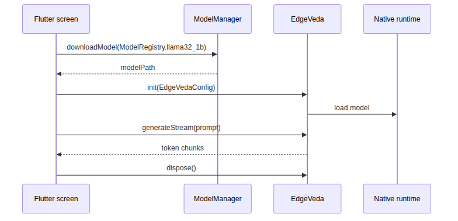

# Перша генерація тексту

Цей гайд створює мінімальний Flutter-екран, який завантажує starter model, ініціалізує Edge Veda і потоково показує згенерований текст в UI.

У результаті ви отримаєте локальний text generation flow, який працює на пристрої без cloud inference API.

## Перед початком

Спочатку виконайте [`installation.md`](./installation.md).

У вас має бути:

- Flutter-проєкт із встановленим `edge_veda`;
- iOS target з `platform :ios, '13.0'` в `ios/Podfile`;
- встановлений CocoaPods і підтягнуті pods;
- підключений фізичний iPhone для реалістичного performance-тесту.

## Як працює приклад

Приклад використовує таку послідовність:

1. Створити екземпляри `EdgeVeda` і `ModelManager`.
2. Завантажити або повторно використати starter model з `ModelRegistry`.
3. Визначити профіль пристрою.
4. Отримати рекомендовану конфігурацію через `ModelAdvisor`.
5. Ініціалізувати runtime через `EdgeVedaConfig`.
6. Передати згенеровані токени через `generateStream()`.
7. Звільнити runtime resources після закриття екрана.



## Замініть `lib/main.dart`

Замініть вміст `lib/main.dart` на цей приклад:

```dart
import 'package:edge_veda/edge_veda.dart';
import 'package:flutter/material.dart';

void main() => runApp(const MyApp());

class MyApp extends StatelessWidget {
  const MyApp({super.key});

  @override
  Widget build(BuildContext context) {
    return const MaterialApp(
      title: 'Edge Veda Quickstart',
      home: TextGenerationScreen(),
    );
  }
}

class TextGenerationScreen extends StatefulWidget {
  const TextGenerationScreen({super.key});

  @override
  State<TextGenerationScreen> createState() => _TextGenerationScreenState();
}

class _TextGenerationScreenState extends State<TextGenerationScreen> {
  final _edgeVeda = EdgeVeda();
  final _modelManager = ModelManager();

  String _output = 'Initializing...';
  bool _isLoading = true;

  @override
  void initState() {
    super.initState();
    _setup();
  }

  Future<void> _setup() async {
    try {
      setState(() {
        _output = 'Downloading model...';
        _isLoading = true;
      });

      final modelPath = await _modelManager.downloadModel(
        ModelRegistry.llama32_1b,
      );

      final device = DeviceProfile.detect();
      final scored = ModelAdvisor.score(
        model: ModelRegistry.llama32_1b,
        device: device,
        useCase: UseCase.chat,
      );

      final config = EdgeVedaConfig(
        modelPath: modelPath,
        contextLength: scored.recommendedConfig.contextLength,
        numThreads: scored.recommendedConfig.numThreads,
        useGpu: true,
      );

      setState(() {
        _output = 'Loading model...';
      });

      await _edgeVeda.init(config);

      if (!mounted) return;
      setState(() {
        _output = 'Ready. Tap Generate.';
        _isLoading = false;
      });
    } catch (error) {
      if (!mounted) return;
      setState(() {
        _output = 'Initialization error: $error';
        _isLoading = false;
      });
    }
  }

  Future<void> _generate() async {
    setState(() {
      _output = '';
      _isLoading = true;
    });

    try {
      await for (final chunk in _edgeVeda.generateStream(
        'Explain what on-device AI means in two short sentences.',
      )) {
        if (!mounted) return;

        if (!chunk.isFinal) {
          setState(() {
            _output += chunk.token;
          });
        }
      }
    } catch (error) {
      if (!mounted) return;
      setState(() {
        _output = 'Generation error: $error';
      });
    } finally {
      if (mounted) {
        setState(() {
          _isLoading = false;
        });
      }
    }
  }

  @override
  void dispose() {
    _edgeVeda.dispose();
    _modelManager.dispose();
    super.dispose();
  }

  @override
  Widget build(BuildContext context) {
    return Scaffold(
      appBar: AppBar(title: const Text('Edge Veda Quickstart')),
      body: Padding(
        padding: const EdgeInsets.all(16),
        child: Column(
          crossAxisAlignment: CrossAxisAlignment.stretch,
          children: [
            Expanded(
              child: SingleChildScrollView(
                child: Text(
                  _output,
                  style: const TextStyle(fontSize: 16),
                ),
              ),
            ),
            const SizedBox(height: 16),
            ElevatedButton(
              onPressed: _isLoading ? null : _generate,
              child: Text(_isLoading ? 'Working...' : 'Generate'),
            ),
          ],
        ),
      ),
    );
  }
}
```

## Запустіть застосунок

Запустіть на фізичному iPhone в release mode:

```bash
flutter run --release
```

Перший запуск може тривати довше, бо модель потрібно завантажити й ініціалізувати. Наступні запуски мають використовувати cached model.

## Альтернатива: blocking generation

Використовуйте `generate()`, коли потрібна повна відповідь після завершення генерації:

```dart
final response = await _edgeVeda.generate(
  'Give me one practical use case for on-device AI.',
);

print(response.text);
```

Використовуйте `generateStream()`, коли UI має показувати токени по мірі їх появи.

## Очікувана поведінка

Коли застосунок працює коректно:

1. При першому запуску екран показує `Downloading model...`.
2. Під час ініціалізації inference engine екран показує `Loading model...`.
3. Після готовності екран показує `Ready. Tap Generate.`.
4. Після натискання **Generate** текст з’являється поступово.

## Troubleshooting

| Симптом | Можлива причина | Як виправити |
| --- | --- | --- |
| Перший запуск триває довго | Модель завантажується або вперше ініціалізується. | Не закривайте застосунок і використовуйте Wi-Fi. |
| Текст з’являється дуже повільно | App запущено в debug mode або на Simulator. | Використайте `flutter run --release` на фізичному iPhone. |
| З’являється `Initialization error` | Не вдалося завантажити модель, не вистачає storage або runtime не ініціалізувався. | Перевірте storage, network і Xcode logs. |
| З’являється `Generation error` | Runtime впав під час генерації. | Спробуйте коротший prompt і перегляньте logs. |
| Кнопка залишається disabled | `_isLoading` не скинувся після exception. | Переконайтеся, що `finally` оновлює state, якщо widget ще mounted. |
| App падає після виходу з екрана | Runtime resources не звільняються. | Залиште `dispose()` і звільняйте `EdgeVeda` та `ModelManager`. |

## Наступні кроки

Після успішної першої генерації перейдіть до:

- multi-turn chat documentation;
- model compatibility notes;
- performance tuning;
- runtime supervision;
- troubleshooting and platform notes.
