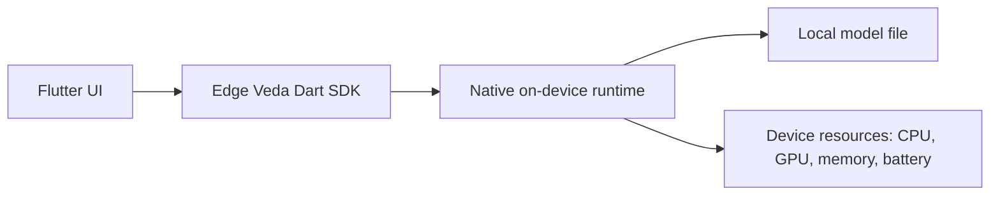

# Огляд Edge Veda

Edge Veda — це керований on-device AI runtime для Flutter-застосунків. Він призначений для запуску AI-навантажень на пристрої користувача, а не через запити до cloud API.

Почніть з цієї сторінки перед встановленням SDK або запуском першого прикладу генерації тексту.

## Що робить Edge Veda

Edge Veda надає supervised runtime для локальних AI-функцій у Flutter-застосунках. Основний фокус — стабільна, спостережувана й адаптована до пристрою інференс-робота, а не короткі demo-виклики моделі.

На високому рівні Edge Veda можна використовувати для:

- генерації тексту та потокового виводу токенів;
- multi-turn chat sessions;
- vision та image understanding workflow;
- speech-to-text і text-to-speech workflow;
- embeddings та on-device retrieval-augmented generation;
- structured output і function calling;
- runtime supervision для memory, battery, thermal і latency constraints.

## Навіщо використовувати on-device runtime

On-device AI корисний, коли застосунок має зберігати дані локально, менше залежати від мережі або надавати AI-функції без cloud inference service.

Edge Veda особливо доречний, коли потрібно:

- обробляти чутливі дані локально;
- не використовувати API keys у runtime застосунку;
- зберігати AI-функції доступними при слабкому або відсутньому інтернеті;
- контролювати поведінку runtime під реальними обмеженнями пристрою;
- повторно використовувати завантажену модель для кількох запитів генерації.

## Як Edge Veda вбудовується у Flutter-застосунок

Типова інтеграція Edge Veda має чотири частини:

1. **Flutter UI** — збирає prompt, показує результат і обробляє дії користувача.
2. **Edge Veda Dart SDK** — надає публічні Flutter/Dart API, зокрема `EdgeVeda`, `EdgeVedaConfig`, `ModelManager` і методи генерації.
3. **Native runtime** — запускає локальний inference engine через native bindings.
4. **Model files** — локальні файли моделей, які застосунок завантажує, імпортує або постачає разом із білдом.



## Поточний getting-started шлях

Рекомендований перший шлях:

1. Прочитайте цей огляд.
2. Встановіть SDK і підготуйте iOS-проєкт у [`installation.md`](./installation.md).
3. Запустіть перший приклад локальної генерації тексту в [`first-text-generation.md`](./first-text-generation.md).

Цей розділ Getting Started фокусується на iOS, тому що саме цей шлях найкраще описаний у quickstart-документації проєкту. Інші платформи варто вважати такими, що потребують додаткової перевірки перед публікацією production-документації.

## Що ви створите першим

Перший приклад ініціалізує Edge Veda, завантажує локальну модель і передає згенерований текст у Flutter-екран потоком.

Мінімальний flow:

```dart
final edgeVeda = EdgeVeda();

await edgeVeda.init(EdgeVedaConfig(
  modelPath: modelPath,
  contextLength: 2048,
  useGpu: true,
));

await for (final chunk in edgeVeda.generateStream('Explain on-device AI briefly.')) {
  if (!chunk.isFinal) {
    stdout.write(chunk.token);
  }
}
```

## Основні поняття

| Поняття | Значення |
| --- | --- |
| `EdgeVeda` | Основна точка входу SDK для text inference і керування runtime lifecycle. |
| `EdgeVedaConfig` | Runtime-конфігурація для ініціалізації моделі. |
| `ModelManager` | Завантажує або імпортує підтримувані файли моделей. |
| `ModelRegistry` | Надає визначення відомих моделей, наприклад `ModelRegistry.llama32_1b`. |
| `ModelAdvisor` | Оцінює й рекомендує конфігурацію моделі для поточного пристрою. |
| `generate()` | Виконує blocking text generation request і повертає повну відповідь. |
| `generateStream()` | Передає згенеровані частини відповіді по мірі їх появи. |
| `dispose()` | Звільняє runtime resources, коли функція або екран більше не потрібні. |

## Рекомендована перша модель

Для першого тесту генерації тексту почніть із `ModelRegistry.llama32_1b`, якщо документація проєкту або maintainers не рекомендують новішу модель за замовчуванням. Ця модель використовується в офіційному quickstart path і підходить для перевірки базового setup.

## Чим Edge Veda не є

Edge Veda — це не hosted model API і не заміна cloud AI platform. Це локальний runtime для застосунків, яким потрібна on-device AI поведінка.

Не варто розглядати його як:

- general-purpose backend service;
- заміну server-side model orchestration;
- спосіб без обмежень запускати будь-яку модель на будь-якому телефоні;
- гарантію, що всі моделі помістяться на всіх пристроях.

На user experience впливають розмір моделі, quantization, пам’ять, покоління пристрою і режим запуску — release або debug.

## Наступний крок

Перейдіть до [`installation.md`](./installation.md), щоб додати Edge Veda до Flutter-проєкту й підготувати iOS runtime.
