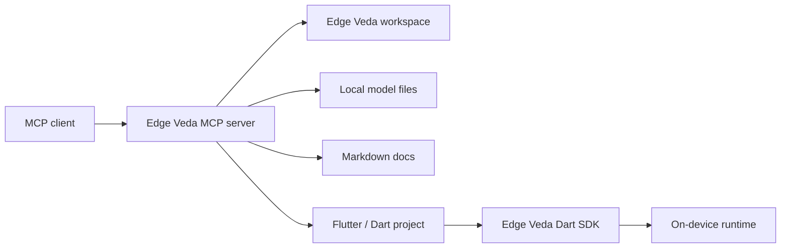

# Огляд MCP

MCP-інтеграція Edge Veda дає AI client контрольований доступ до Edge Veda workspace через локальний tool layer.

MCP означає **Model Context Protocol**. У цьому наборі документації MCP використовується для того, щоб безпечно відкривати project, model, diagnostics і documentation helpers для сумісних AI clients без необмеженого доступу до file system.

Використовуйте цей розділ, коли потрібно:

- підключити MCP-compatible client до Edge Veda project;
- переглянути стан локального project через tools;
- створити starter Edge Veda project з template;
- перевірити `modelPath`, platform settings і project structure;
- зібрати troubleshooting data без ручного пошуку по repository.

## Де MCP розміщується в Edge Veda

Edge Veda орієнтований на on-device AI workflow: text generation, streaming, embeddings, RAG, vision, speech, image generation, runtime policy, scheduler behavior і offline privacy. MCP layer не замінює Dart SDK. Він дає зовнішнім AI clients безпечний спосіб викликати helper tools навколо SDK і project workspace.



## Основні компоненти

| Component | Відповідальність |
| --- | --- |
| MCP client | Надсилає tool calls і показує результат користувачу. |
| Edge Veda MCP server | Відкриває project-specific tools, перевіряє inputs і повертає structured responses. |
| Edge Veda workspace | Містить app code, model configuration, examples, docs і generated artifacts. |
| Local model store | Зберігає GGUF, Whisper, VLM, image generation або embedding models, які використовує app. |
| Dart SDK | Запускає Edge Veda capabilities у Flutter або Dart application. |

## Потік запиту

Типовий MCP request проходить так:

1. Користувач просить AI client перевірити, створити або виправити щось в Edge Veda project.
2. AI client обирає Edge Veda MCP tool.
3. MCP server перевіряє `workspaceRoot`, `projectName`, `modelPath` та інші inputs.
4. MCP server читає або записує лише дозволені files.
5. MCP server повертає structured result із summary, changed files, warnings і next actions.
6. Користувач переглядає результат перед запуском, commit або publication.

## З чим допомагає MCP server

MCP server призначений для таких задач:

- створення starter project;
- перевірка project structure;
- перегляд available tools і required arguments;
- перевірка наявності model files;
- виявлення типових installation issues;
- генерація starter configuration files;
- створення базових documentation stubs;
- перевірка docs links і file naming;
- збір environment diagnostics для troubleshooting.

## Що MCP server не має робити

Не використовуйте MCP tools як заміну прямому source review або production release validation.

MCP server не має:

- автоматично публікувати packages;
- завантажувати models у зовнішні services;
- надсилати user prompts, documents, audio або images у remote service без явної configuration;
- змінювати production secrets;
- робити commit або push без підтвердження користувача;
- стверджувати, що generated code готовий до production без manual review.

## Приклад MCP client configuration

Точне місце файлу залежить від MCP client. Використовуйте приклад як стартову точку і адаптуйте command під ваш спосіб installation.

```json
{
  "mcpServers": {
    "edge-veda": {
      "command": "edge-veda-mcp",
      "args": [
        "--workspace-root",
        "/absolute/path/to/edge-veda-app",
        "--config",
        "/absolute/path/to/edge-veda.mcp.json"
      ],
      "env": {
        "EDGE_VEDA_MCP_LOG_LEVEL": "info"
      }
    }
  }
}
```

## Приклад workspace configuration

Створіть `edge-veda.mcp.json` у project root, коли MCP server потребує project-specific defaults.

```json
{
  "workspaceRoot": ".",
  "projectType": "flutter",
  "docsRoot": "docs",
  "modelsRoot": "models",
  "defaultPlatforms": ["ios", "macos"],
  "allowWrites": true,
  "allowedWritePaths": [
    "lib",
    "test",
    "docs",
    "examples",
    "edge_veda.config.json"
  ]
}
```

## Security model

Сприймайте MCP server як локальний automation layer з явними межами.

Рекомендовані defaults:

- дозволяти reads лише всередині `workspaceRoot`;
- дозволяти writes лише у відомі project paths;
- тримати `allowWrites` вимкненим для audit-only sessions;
- не відкривати private keys, Apple signing certificates або production credentials через MCP results;
- переглядати всі generated files перед запуском;
- комітити MCP-generated changes через звичайний pull request.

## Privacy model

Edge Veda орієнтований на local і offline AI workflow. MCP має зберігати це очікування.

MCP server має:

- обробляти local project files локально;
- не завантажувати model files або user content;
- редагувати secrets у diagnostics;
- повертати file paths і summaries замість повних sensitive documents, де це доречно;
- явно показувати будь-яку remote dependency у tool response.

## Швидкі перевірки

| Symptom | Що перевірити |
| --- | --- |
| MCP client не показує Edge Veda tools | Переконайтесь, що MCP server command є в `PATH`, а client configuration вказує на правильний executable. |
| Tool call падає з `workspace_not_found` | Використайте абсолютний `workspaceRoot` і перевірте, що директорія містить `pubspec.yaml`. |
| Project creation не працює | Перевірте write permissions і переконайтесь, що target folder не містить конфліктних files. |
| Model validation не проходить | Перевірте `modelsRoot`, `modelPath`, file extension і platform support. |
| Generated docs неповні | Запустіть tool ще раз із точнішими `projectName`, `capabilities` і `targetPlatforms`. |
